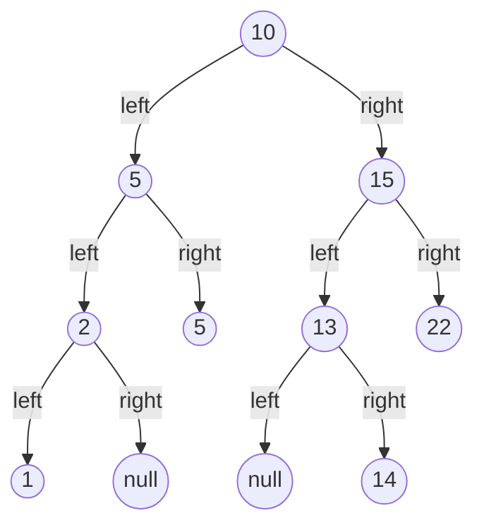

```mermaid
graph TD
  A((10))
  B((5))
  C((2))
  D((1))
  E((5))
  F((15))
  G((13))
  H((14))
  I((22))

  A --> |left| B
  B --> |left| C
  C --> |left| D
  C --> |right| 1((null))
  B --> |right| E
  A --> |right| F

  F --> |left| G

  G --> |left| 2((null))
  G --> |right| H

  F --> |right| I

  %% Style each level differently
  %% style A fill:#f96,stroke:#333
  %% style B fill:#9cf,stroke:#333
  %% style C fill:#9cf,stroke:#333
  %% style D fill:#9f9,stroke:#333
  %% style E fill:#9f9,stroke:#333
  %% style F fill:#9f9,stroke:#333
  %% style G fill:#9f9,stroke:#333

```